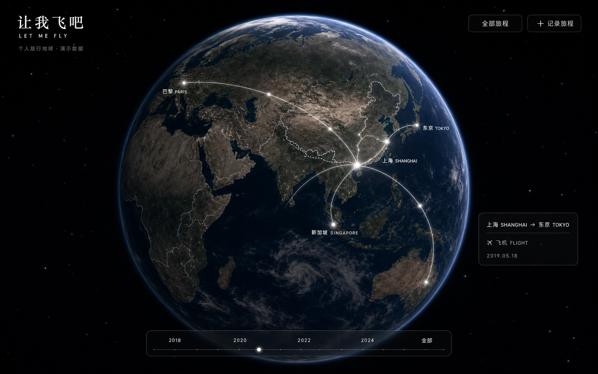
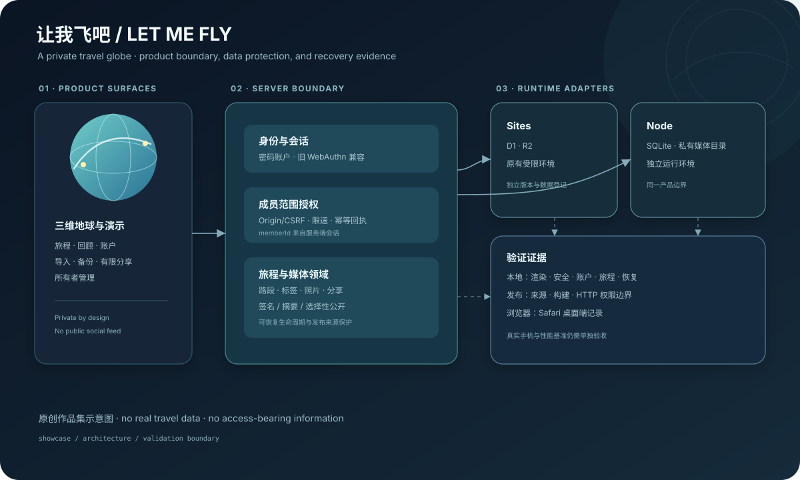

# 让我飞吧 / LET ME FLY

> 一个邀请制的三维旅行地球：把地点、路段、照片与回忆组织成可以回看、备份和有限分享的个人空间。

## English overview

Let Me Fly is a private, invite-only 3D travel globe for a small group of members. It combines a visual globe, journey editing, photo handling, import/export, recovery workflows, and narrowly scoped read-only sharing. The product is designed as a private memory space rather than a public social feed.

这是项目的早期视觉预览，图中地点、航线与日期为演示内容，用于呈现三维地球的视觉方向，不代表当前全部界面。

## 用途与边界

这个项目解决的是一个具体的记录问题：旅行数据分散在地图、照片和零散文件里，回顾时很难保持一趟旅程的完整上下文。产品把地点、交通方式、日期、标签、路段和照片放在同一条可编辑的旅程里，同时保留备份、恢复和选择性分享的边界。

它不是公开注册的旅行社交网络。匿名访客只能看到演示内容；成员空间、账户安全、照片和其他旅程都由服务端会话与成员范围授权保护。

## 核心流程

1. 管理者通过一次性邀请码开通成员，成员设置中文或英文登录账户名与密码；旧账号保留兼容的设备验证升级入口。
2. 成员在三维地球上回看已有记录，或通过任意地点、自定义经纬度和多段路程创建一整趟旅程。
3. 成员可以编辑、删除和恢复旅程，添加标签与照片，在年度回顾中按整趟旅程浏览。
4. JSON、CSV 和完整 ZIP 备份会先经过字段映射、逐行预检、重复识别与可重试提交；导入批次可以在保留期内整体撤销或恢复。
5. 成员可以为单条旅程生成有期限的只读分享，并随时撤销；分享内容不扩展到账户、设备或其他旅程。

## 设计取舍

- 授权以服务端会话中的 `memberId` 为准，请求体中的成员标识不参与授权。这样可以把“当前登录者能看什么”与客户端提交的内容分开。
- `owner` 与 `friend` 分开管理。所有者不占朋友名额，当前本地版本上限为 20 位朋友，也不提供公开注册。
- Sites 运行环境使用 D1/R2；独立 Node 运行环境使用 SQLite/私有媒体目录。两种运行环境共享产品边界，但部署与数据状态分别登记。
- 删除采用可恢复的生命周期；导出和恢复在写入前核对文件大小、签名、摘要与成员范围，优先保护数据可回退性。
- 分享令牌只保存摘要，公开端只返回被选中的单条旅程和照片。服务工作进程只缓存版本化静态资源，不缓存私人 API 或分享 HTML。

## 技术轮廓

React、Next/Vinext、TypeScript、Vite、Three/globe.gl、Drizzle ORM、Cloudflare Workers/Wrangler，以及独立 Node/SQLite 运行适配。仓库还包含服务端路由、数据库迁移、媒体处理、发布来源保护和 Node HTTP 集成检查。

上图为原创结构示意图，不是产品截图。详细组件关系见 [架构说明](docs/architecture.md)。

## 我的职责与协作方式

本人负责需求拆解、成员与数据边界、备份与回退要求、版本确认和体验迭代。实现过程中采用 AI 辅助开发，并结合使用反馈复核功能与行为。

我负责决定哪些能力进入产品、哪些数据必须保留、哪些验证结果可以对外描述，以及在 Sites 与独立运行环境之间如何保持清晰的版本和数据边界。

## 版本与状态（2026-10-03 文档审阅）

| 范围 | 已记录状态 | 证据与边界 |
| --- | --- | --- |
| 本地 `main` 工作区 | 发布标识 `2026.10.01-domain-workflow.6`，源提交 `6227cef` | 本地 `release.json`、`docs/VERSION_STATUS.md`、`docs/ALIYUN_DEPLOYMENT.json` |
| Sites 运行环境 | 第 20 版，2026-09-16 记录为成功，访问策略保持为仅所有者 | 本地 `docs/SITES_DEPLOYMENT.json`；这是部署记录，不代表公开访问 |
| 独立 Node 运行环境 | 2026-10-01 记录为成功，版本和健康检查通过 | 本地 `docs/ALIYUN_DEPLOYMENT.json`；真实手机仍未验收 |
| GitHub 私有镜像 | 应用源码基线为 2026-08-11 的 `670ca5b`，早于当前本地工作区 | 此次只更新展示与说明，应用源码与本地基线存在版本差异 |
| 本展示材料 | 仅包含脱敏文档与原创结构示意图 | 不包含真实旅程、人物、照片、访问令牌、密钥或私人域名 |

## 验证范围

历史记录包含自动化构建、类型检查、渲染、安全、账户、旅程、备份恢复、发布来源和浏览器检查。具体日期、证据路径以及“已记录”与“本次未重跑”的区别见 [验证记录](docs/validation.md)。

本材料没有重新运行完整测试，也没有把文档记录写成新的测试结果；没有承诺帧率、加载时间或其他未经测量的性能指标。

## 已知限制

- 真实 iPhone Safari、真实成员多设备隔离和真实生物识别流程仍需要在私有环境中人工验收。
- 备份与恢复有对应流程和历史验证记录，完整灾备能力仍需独立验收。
- GitHub 镜像仍是历史版本；在未同步源码前，GitHub 中的代码与本展示材料描述的本地工作区不能视为完全一致。
- `assets/overview.svg` 用于解释结构和能力，不代替真实界面截图。

## 展示范围

本仓库提供项目案例、架构图与验证摘要。应用源码与成员记录保留为私有，本页不提供公开注册入口或可运行的应用源码。
