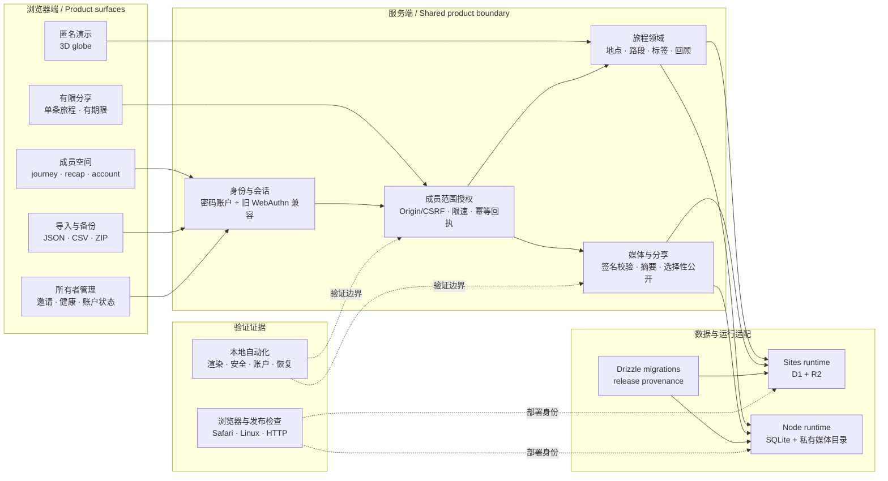

# 系统结构示意 / Architecture

这张图按当前本地 `main` 工作区的代码目录、README、部署回执和运维文档整理。它是面向作品集的结构示意，不是生产网络拓扑，也不是界面截图；图中没有真实账号、旅程、媒体或访问地址。

## 读图方式

| 层 | 能力 | 本地源码或文档证据 |
| --- | --- | --- |
| 浏览器端 | 三维地球、旅程编辑、年度回顾、账户、导入、有限分享与管理入口 | `app/` 下的页面与组件、`README.md` |
| 服务端边界 | 会话、成员范围授权、Origin/CSRF、速率限制、幂等写入 | `lib/session.ts`、`lib/security.ts`、`lib/mutations.ts`、`docs/SECURITY_AND_OPERATIONS.md` |
| 旅程与媒体 | 多段旅程、地点快照、照片校验、选择性分享、恢复 | `lib/trips.ts`、`lib/places.ts`、`lib/photo-privacy.ts`、`lib/shares.ts` |
| 运行适配 | Sites 的 D1/R2 与独立 Node 的 SQLite/私有媒体目录 | `runtime/`、`server/`、`worker/`、`docs/SITES_DEPLOYMENT.json`、`docs/ALIYUN_DEPLOYMENT.json` |
| 质量与发布 | 渲染、安全、账户、旅程、备份恢复、来源和浏览器检查 | `tests/`、`package.json`、`docs/TEST_RESULTS.md`、`release.json` |

两种运行环境共享产品契约，但数据状态和发布记录分别管理。图中虚线表示验证或部署证据的关系，不表示运行时请求路径。

